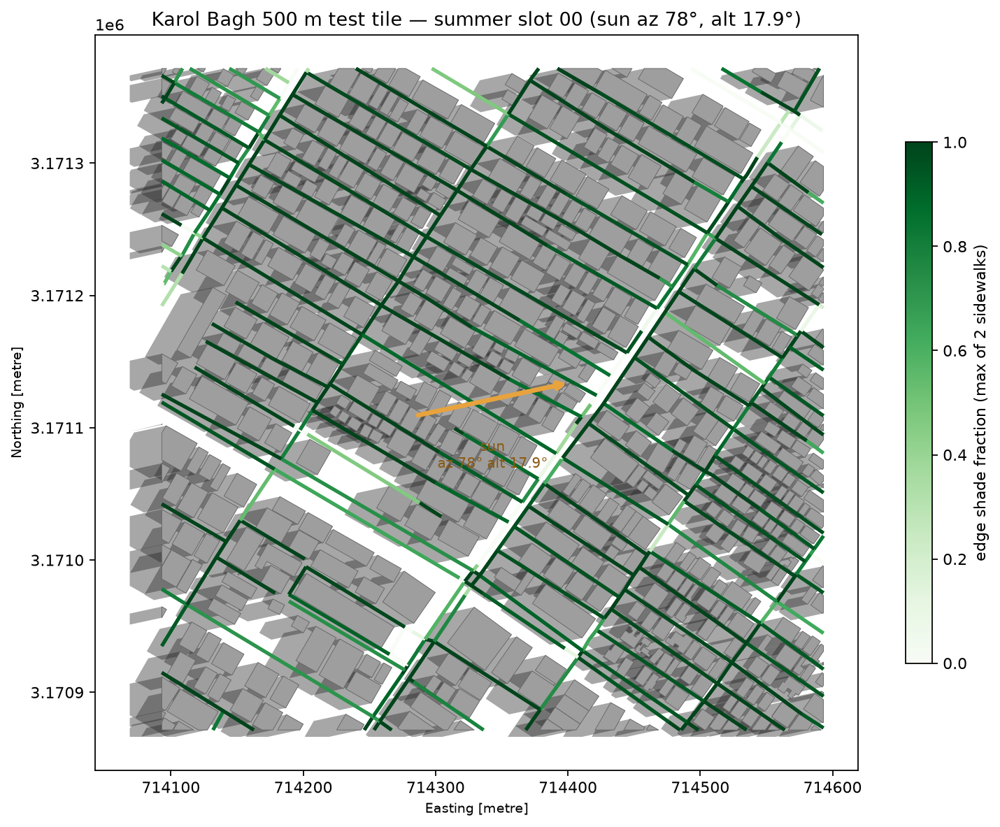
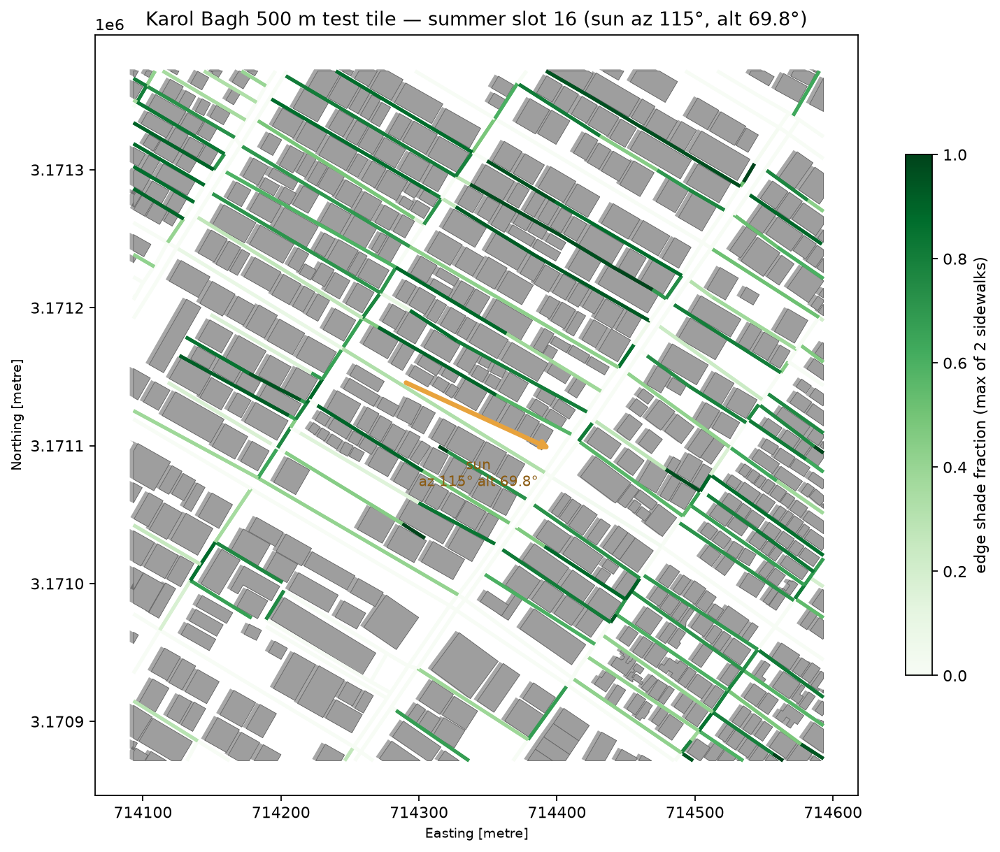
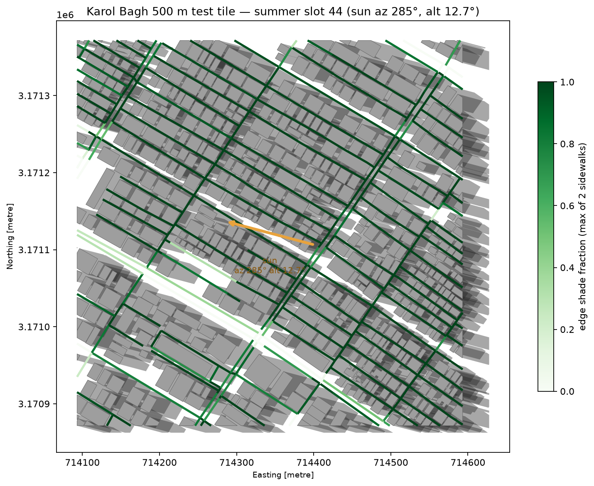
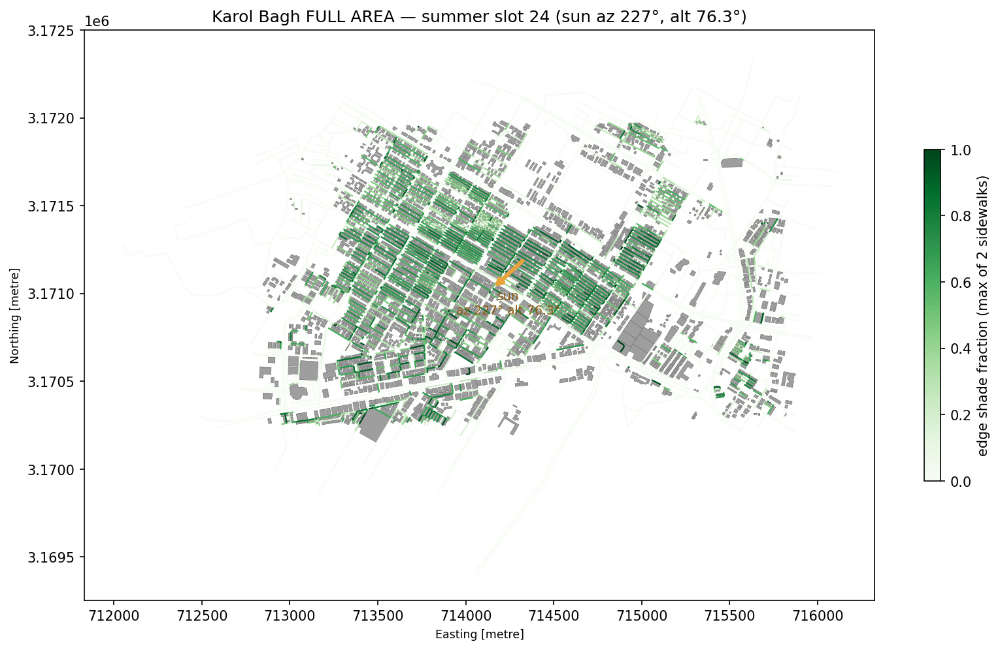
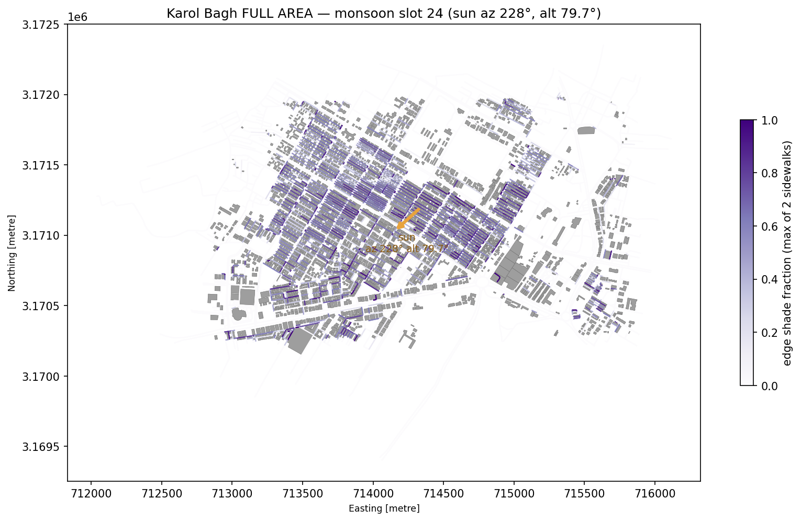
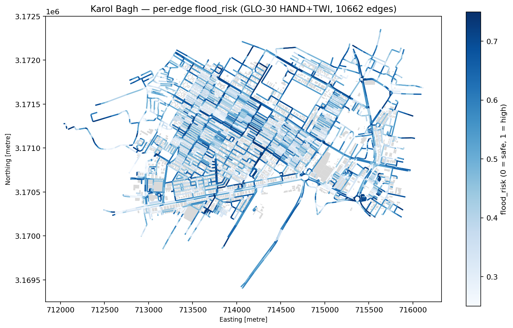

# CHHAYA (छाया) — shade- & flood-aware walking routes for Indian cities

Walking two kilometres through Karol Bagh, Delhi in May heat means picking between the
shortest path and the survivable one — exposed asphalt at 45 °C, waterlogged underpasses in
July. Map apps optimise distance only. **CHHAYA** is a mobile-first web app that shows a
**DIRECT** shortest path and a **CHHAYA** path side by side: in **Summer** mode it chooses
streets that are actually in building shadow at your departure minute; in **Monsoon** mode it
routes around flood-prone low ground. Both lines are drawn on a live map with an honest
comparison card between them — including a Location Service "standard-map" baseline route, so
the trade CHHAYA offers (minutes gained vs minutes in the sun) is always visible, never implied.

> **WeMakeDevs × AWS Environmental Hacks (Bharat Builds Tour event 02), Oct 8–11 2026 ·
> Heat and Water track · coverage: Karol Bagh, Delhi · BBOX 77.178–77.208 °E, 28.642–28.657 °N (~2.9 × 1.7 km)**

## The demo story

- **Summer, 1:30 PM IST in mid-May:** direct vs CHHAYA through dense mid-rise fabric. At that
  slot the Karol Bagh network mean shade is ~20% of street length (measured: slot-26 mean
  `0.197`); the shade-cost function (`a_shade = 2.0`) pushes the Chhaya route into shallow
  blocks and verandas — minutes longer, minutes *in the sun* fewer.
- **Summer, 8:00 AM IST, same two points:** network shade is already ~34% (slot-04 mean
  `0.345`) and evening (18:00) ~49% (`0.495`) — the same picker shows the app's answer changes
  with the sun, because the shadow engine re-computes per 15-minute slot.
- **Monsoon, July 15:** the flood-aware route avoids the streets where the Copernicus GLO-30
  DEM plus HAND/TWI ranks waterlogging risk highest (per-edge `flood_risk` 0–1, deployed
  network scores mean `0.500`, p90 `0.700`, max `0.750`; `a_flood = 4.0`, `a_under = 5.0` hard
  underpass penalties) and stays dry where the direct route stays cheap.
- **A grey dashed third line** — Amazon Location Routes `CalculateRoutes` (Pedestrian) drawn
  in the browser — is the honest baseline: this is what a standard map already gives you, and the comparison card prices the difference against it.

### Shadow engine, verified by eye — morning west, evening east, noon short and north

Everything geospatial in this repo passes a human gate before it is trusted (§0 rule 3 of
`CLAUDE.md`). The plots below are generated by the committed pipeline from real OSM
geometries, and were reviewed before Phase 2 accepted the arrays:

| 8:00 AM — shadows point **west**, long | 1:00 PM — shadows **short, north** | 6:00 PM — shadows point **east** |
| --- | --- | --- |
|  |  |  |

Monsoon date (July 15) and full-area frames live alongside them:

| summer full area, post-noon | monsoon full area, post-noon | flood-risk map |
| --- | --- | --- |
|  |  |  |

Web screenshots (comparison screen, mode toggle, slot strip, degraded no-key state) are
recorded as QA evidence in [PR #7](https://github.com/teamaekovera-glitch/chhaya/pull/7)
(four storyboard verdicts, `tc-1`…`tc-4`, iPhone-13 viewport, with `?mock=1` synthetic data
because the live-deploy screenshots await credentials).

## Architecture

```text
                       ┌──────────────────────────────┐
   Browser (Amplify    │  React 18 + MapLibre + Vite  │──── tiles / style, │
   Hosting, static)    │  comparison chips, 48-slot   │  Places v2 SearchText,      │
                       │  strip, mode toggle          │  Routes v2 CalculateRoutes  │
                       └──────┬───────────────────────┘   (Amazon Location Service,
                              │  API key, referer-restricted)
                              │ POST /route  (HTTP API + CORS)
                              ▼
                       ┌──────────────────────────────┐
                       │  Route Lambda (python3.12)   │  cold start: S3 → /tmp,
                       │  numpy + networkx            │  graph.pkl + .npz/.npy, cached
                       │  direct / shade / flood      │  in-memory; LRU warm cache
                       │  Dijkstra, cost per §8.1     │
                       └──────┬───────────────────────┘
                              │ EMF metrics (RouteLatencyMs, ExtraMin, ShadeGainPct)
                              ▼
                       ┌──────────────────────────────┐        ┌──────────────────────────┐
                       │  S3 chhaya-mvp-graph         │◀───────│  Step Functions          │
                       │  graph/graph.pkl             │  write │  ShadePipeline           │
                       │  graph/nodes.npz             │        │  Map(seasons × slots) →  │
                       │  shade/{summer,monsoon}.npy  │        │  assemble_graph Lambda   │
                       │  flood/flood.npy             │        │  + chhaya-mvp dashboard  │
                       │  graph/coverage.geojson      │        └──────────────────────────┘
                       └──────────────────────────────┘
                              ▲
                Local pipeline (laptop): osmnx → heights → pvlib-verified NOAA solar
                → shadow polygons (shapely) → shade %/slot → Copernicus GLO-30 + pysheds
                HAND/TWI → flood_risk → build_graph → upload.py
```

(Stretch Lambdas `report` (DynamoDB crowd reports) and `advice` (Bedrock) are planned but
**not stacked into the MVP** — see [docs/ROADMAP.md](docs/ROADMAP.md).)

### Where AWS fits

| Service | Used | Why |
| --- | --- | --- |
| **Amazon Location Service** | Maps v2 Standard style + tiles rendered by MapLibre · Places v2 `SearchText` (one call, BBox-filtered to Karol Bagh) · Routes v2 `CalculateRoutes` (Pedestrian) baseline drawn in the browser | Real basemap, geocoding, and the honest grey third line |
| **Lambda + API Gateway (HTTP API)** | Direct / shade / flood Dijkstra at `WALK_SPEED_MPS=1.1`, graph stats | Pay-per-invoke routing with no always-on server |
| **S3** | `graph.pkl` + `.npz`/`.npy` artefacts | One artefact store, no database |
| **Step Functions** | Season-grained Map state machine re-runs precompute and re-assembles the graph | Repeatable ops path for new seasons/data |
| **Sam/CloudFormation (`infra/template.yaml`)** | The single stack everything above deploys from | One-command deployment |
| **CloudWatch** | Dashboard `chhaya-mvp`: Lambda invocations / duration / errors, HttpApi 4xx/5xx, state-machine `ExecutionsStarted/Failed`, ops-notes text widget | Shows the routing path and the ops path working after deploy |
| **Amplify Hosting** | The static web app | CI-deployed, `web/amplify.yml` |

**Deliberately not used:** RDS/Aurora (no relational need — the graph is a pickle and warm
Lambdas keep an in-memory LRU), containers/EKS (Lambda zips + layers fit the 250 MB unzipped
budget, verified in DEPLOY.md's size guard), Cognito (anonymous reports are fine for the MVP
surface), Bedrock and DynamoDB (stretch items, see ROADMAP), and NAT gateways / load
balancers / EC2, ever (§4 hard list).

## The MVP — master-prompt mapping (M1–M8)

Each row names what in this repo fulfils which line of the master prompt:

| # | Master-prompt requirement | Where it lives | Status |
| --- | --- | --- | --- |
| **M1** | One neighbourhood as `AREA_NAME` + `BBOX`; coverage polygon drawn, points outside rejected kindly | `pipeline/config.py` (`Karol Bagh`, `BBOX = (77.178, 28.642, 77.208, 28.657)`), `data/coverage.geojson`, Lambda `400 outside_coverage`, UI banner | Shipped (code + tests); deployed-value pending credentials* |
| **M2** | Per-street shade fraction, 48 slots 07:00–18:45 IST × Summer (May 15) + Monsoon (Jul 15) | `pipeline/shade.py` → `data/shade_{summer,monsoon}.npy` float16 `(10662, 48)`; `pipeline/plots/shadows_*.png` reviewed | Shipped (code + committed arrays + plots)* |
| **M3** | Per-street flood score 0–1 from Copernicus GLO-30 (HAND/TWI) + OSM tunnel/underpass flags + manual hotspots | `pipeline/dem_flood.py` → `data/flood.npy`; underpass/bridge flags from parse; the optional `data/hotspots.geojson` overlay file has no Karol Bagh list yet (the code path is built and tested against synthetic hotspots — stated honestly) | Shipped (code + array)* |
| **M4** | Routing Lambda behind API Gateway: direct + Chhaya as GeoJSON with stats | `lambdas/route/handler.py` + `routing.py` + `cost.py`, `tests/test_route_api.py` (30 tests) | Shipped (code + tests)* |
| **M5** | React + MapLibre frontend on Amplify: search, time, mode, comparison, mobile layout | `web/` — pickers (Places SearchText), 48-slot strip, season/mode toggle, three route lines, chips, degraded/targeted states, `?mock=1` | Shipped (code; live-map screenshots in PR #7 QA)* |
| **M6** | Amazon Location Routes pedestrian baseline as a third line | Browser-side `CalculateRoutes` from `web/src/api.ts` (locked decision: browser, not Lambda) | Shipped (code); live call pending key* |
| **M7** | CloudWatch logs + custom metrics + one dashboard | `infra/template.yaml` `Dashboard` + `ChhayaOpsDashboard`, EMF metric wiring | Shipped (template)* |
| **M8** | Everything deployed from `infra/template.yaml` with SAM | `infra/template.yaml` + `samconfig.toml` (placeholders) + `docs/DEPLOY.md` record of the exact `sam` sequence | Shipped (template + runbook)* |

`*` **Honest status block — what runs and what waits.** Every module above is merged code
with passing local gates: `pytest tests/` = **96 passed + 2 skipped (98 collected)**,
`web` vitest = **21 tests**. What is **not yet true**: no AWS credentials in this build
environment, so the stack, the graph bundle, the Location API key and the Amplify URL are
"one-command pending", not live. The exact deploy sequence (budget alert first, always) is
in [docs/DEPLOY.md](docs/DEPLOY.md); the four blockers, each to be closed the moment
credentials exist, are recorded in [docs/BLOCKERS.md](docs/BLOCKERS.md).

## Karol Bagh, in numbers (all measured from the committed pipeline)

| Fact | Value | Verified by |
| --- | --- | --- |
| Buildings with heights | **4,663** (`n_geometries` in `data/buildings.npz`) | `numpy` load, this repo |
| Walk edges scored | **10,662** directed edges (`data/edges.npz` shape) | `numpy` load |
| Routable nodes (post-connectivity) | **4,386** of 4,425 raw OSM nodes = **99.1%** kept in the largest weakly connected component (`data/nodes.npz`; gate floor 95%) | `numpy` load + `pipeline/build_graph.py` gate |
| Shade grid | 48 slots × 2 seasons per edge, float16 `(10662, 48)` per season | `data/shade_*.npy` shapes |
| Network shade means | summer all-slot mean `0.30`; 08:00 `0.345` · 13:30 `0.197` · 18:00 `0.495`; monsoon 13:30 `0.185` | `numpy` load |
| Flood risk | mean `0.500`, p90 `0.700`, max `0.75`; edges above 0.5: **5,326**; bridges = 0.0 | `data/flood.npy` load |
| GLO-30 DEM window | 248 × 203 cells at ~28.5 m, elevations 199.9–264.2 m, reads unauthenticated from `s3://copernicus-dem-30m/` tile `N28_00_E077_00` | `pipeline/dem_flood.py` + DECISIONS.md |
| Height fill rate | 0 direct `height` tags; 2.6% `building:levels`; 96.8% type-default (mostly 8 m) — stated openly, not hidden | `pipeline/heights.py` log (DECISIONS.md) |
| Underpasses mapped in this OSM extract | **0** (the monsoon `a_under = 5.0` penalty + tunnel-parse path stay live; where a city maps tunnels they are excluded) | `pipeline/parse_map_osm.py` + §7.6 gate |

## Quickstart (per §5)

```bash
# ---- tests (no credentials needed) ----
pip install -r tests/requirements.txt
pytest tests/                                    # 98 collected: 96 pass, 2 skipped today

cd web && npm ci && npx vitest run               # 21/21 green; npm run dev then ?mock=1 for no-key UI

# ---- regenerating the data (laptop only; heavy geospatial deps in pipeline/requirements.txt) ----
cd pipeline
python parse_map_osm.py                            # OSM fabric (Overpass unreachable 2026-10-07 → api.openstreetmap.org full extract)
python heights.py                                  # height ladder per §7.2
python dem_flood.py                                # GLO-30 HAND/TWI flood_risk per edge
python shade.py --test-tile --season summer --slots 0,16,24,32,44    # 500 m tile first, inspector plot
python shade.py --full --season summer             # full-area, all 48 slots
python shade.py --full --season monsoon
python export_arrays.py                            # §6.4 ragged arrays for the Lambda route path
python build_graph.py                              # graph.pkl + nodes.npz + coverage.geojson + §7.6 sanity gate

# ---- upload + deploy (needs credentials; DEPLOY.md has the exact order) ----
export GRAPH_BUCKET=chhaya-mvp-graph
python upload.py                                   # dry-run by design
python upload.py --execute                         # push bundle to S3
cd ../infra && sam build && sam deploy --guided    # stack; then DEPLOY.md §4 for keys + Amplify
```

Design decisions and their justifications live in [docs/DECISIONS.md](docs/DECISIONS.md) —
notable: the coverage area is **Karol Bagh** (dense mid-rise fabric makes the shade choice
*visible* in the demo); **Places v2 `SearchText` in one call** (no `Autocomplete` →
`GetPlace` pair); the **baseline route runs in the browser**, keeping the Lambda's IAM
surface to S3-read only; `geo-maps:GetStyleDescriptor` is in the Location key's
`AllowActions` (docs-verified *not* in the upstream doc's action list, added after a
CFN-docs check and a blank-map failure recorded in DECISIONS.md).

## Test matrix (local gates run on every PR; the runbook is §9)

| Suite | File(s) | Gate |
| --- | --- | --- |
| Solar vs pvlib | `tests/test_solar.py` | `shared/solar_numpy.py` accurate-NOAA under 0.5° altitude / azimuth error vs `pvlib` both dates × 48 slots |
| Shadow geometry | `tests/test_shadow.py` | az 180°→north sweep; az 90°→west; area ≈ footprint + sweep; azimuth-from-north fixed |
| Shade math | `tests/test_shade_math.py` | sidewalk offsets, max-of-two-sides, union/STRtree paths |
| Cost | `tests/test_route_api.py` + `test_config.py` | cost ≥ length always; raising shade lowers summer cost; mode weights bound |
| API contract | `tests/test_route_api.py` | response keys, `400 outside_coverage` shape, `/route/stats` |
| Graph sanity | `tests/test_graph_sanity.py` | shade monotonicity across slots, flood in [0,1], NaN-free, ≥ 95% weakly connected |
| Serverless pipeline | `tests/test_statemachine.py`, `test_precompute_handler.py` | ASL task wiring (lambda:invoke integrations), handler head_object → validate → manifest |
| Web unit | `web/src/*.test.ts` | 21 tests — slot labels, clamping, format/distance/percent |
| Visual PRs | PR #7 reports | 4 storyboards (boot, season toggle, slot strip, no-key state) recorded against tested SHA with before/after + WebM |

## Tech stack

| Layer | Choices |
| --- | --- |
| Pipeline (laptop) | Python 3.13 (py3.12 semantics), osmnx ≥ 2.0, geopandas, pysheds 0.5, rasterio 1.5, shapely 2.x, pvlib (test-only), numpy < 2.2 (pysheds `np.in1d`), pandas, networkx, matplotlib, boto3 |
| Shared math | `shared/solar_numpy.py` — pure-numpy accurate NOAA solar position (no pytz, no date libs), consumed by pipeline **and** tests as a vendored copy for the shade Lambda |
| Lambdas | python 3.12 x86_64; `route` = numpy + networkx only; `shade_slot` = numpy + shapely only (§0 rule 5); `report` / `advice` = boto3 only (stretch) |
| Web | React 18 + TypeScript, Vite 5, MapLibre GL 4, no UI framework, no AWS SDK |
| Infra | AWS SAM (`template.yaml`, `statemachine.asl.json`, `samconfig.toml` with placeholders), Amplify Hosting |
| Location stack | Maps v2 Standard style descriptor + tiles, Places v2 `SearchText`, Routes v2 `CalculateRoutes` (browser, referer-restricted API key) |

## Honest status — shipped vs credentials-pending

Everything above the middle line is **shipped and merged on `main` in this repo**. What is
**not shipped is live, not fake** — nothing pretending to be deployed:

| Item | Status |
| --- | --- |
| Repo skeleton, pipeline, tests, Lambda code, web code, SAM template | merged as PRs #1–#7 (96 pytest passing + 21 vitest green) |
| Deployed SAM stack (API URL, Location key, Amplify URL) | ⏳ pending AWS credentials — template validated offline (`sam validate`), exact deploy commands staged in `docs/DEPLOY.md` |
| Graph on S3 (cold start path tested offline) | ⏳ `pipeline/upload.py` written, write-guarded, `--execute` waits for creds |
| Live Location Service calls (map style, search, baseline route) | ⏳ key-restricted; mocked-shape tests green; real-key go-live checklist in `docs/BLOCKERS.md` |
| Crowd reports (S1) / Bedrock advice (S3) | not built in this MVP window — see [docs/ROADMAP.md](docs/ROADMAP.md) |

## Project docs

- [`docs/DECISIONS.md`](docs/DECISIONS.md) — every build decision, one line each (§0 rule 7)
- [`docs/DEPLOY.md`](docs/DEPLOY.md) — the exact bring-the-stack-alive sequence
- [`docs/BLOCKERS.md`](docs/BLOCKERS.md) — four deploy blockers, each with its §11 fallback
- [`docs/ROADMAP.md`](docs/ROADMAP.md) — what we cut and why (per the master prompt's stretch list)
- [`docs/SUBMISSION.md`](docs/SUBMISSION.md) — hackathon submission writeup
- [`docs/VIDEO_SCRIPT.md`](docs/VIDEO_SCRIPT.md) — 2.5–3 min demo video script
- [`CLAUDE.md`](CLAUDE.md) — master build prompt (contracts, algorithms, §–§ frozen)

AI tools used (submission requirement): Obvious agent + Claude — see
[`docs/AI_TOOLS.md`](docs/AI_TOOLS.md).

---

**Data credits (the honest kind):**

- Street network + buildings: © [OpenStreetMap](https://www.openstreetmap.org) contributors — CHHAYA's whole cost landscape exists because volunteers mapped Karol Bagh's buildings and lanes
- Terrain/flood surface: [Copernicus GLO-30 DEM](https://registry.opendata.aws/copernicus-dem/) (public `s3://copernicus-dem-30m/`)
- Map tiles, place search, baseline route: Amazon Location Service
- Solar position verified against [pvlib](https://pvlib-python.readthedocs.io/) (test-only dependency)
